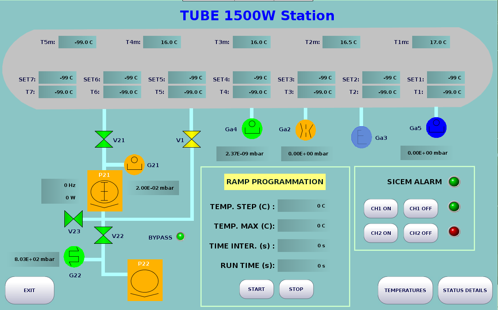

# SCADARPI

SCADARPI is a multi-application Java 8 project for SCADA/HMI stations, designed primarily for [Raspberry Pi](https://www.raspberrypi.com/) embedded systems.  
This work relies on the [GenLogic](https://www.genlogic.com/) GLG Toolkit for Java to build SCADA/HMI interfaces.
Use GenLogic **GlgBuilder** to create and maintain the `.g` graphics files.
Each `work_*` directory is a standalone application (own `Main.java`, device logic, GUI drawings, and logs), while top-level tooling (`scadarpi`, `Makefile`) gives one uniform way to compile and run them.

## Illustration



## Project layout

- `scadarpi`: main CLI used to list targets, compile, run, and clean.
- `Makefile`: thin wrapper around `./scadarpi`.
- `lib/`: all third-party JARs used by the applications (Pi4J, jlibmodbus, GLG, serial libs, sqlite, etc.).
- `work_*`: application modules (for example `work_panel`, `work_rga`, `work_venting`, `work_mainpanel`).
- `*.g` files in `work_*`: GLG drawing files (built/edited with GlgBuilder) used by the GUI classes.

## Runtime model (high level)

Most modules follow this startup pattern:
- `Main` builds a `DeviceManager`, creates one or more `Device` instances, starts their threads, starts a `ModbusSlaveThread`, then opens a `GlgGui`.
- `Device` subclasses encapsulate hardware/network integration (I2C, serial, Modbus TCP, HTTP clients, etc.).
- The Modbus server interface exposed to remote clients is implemented with [jlibmodbus](https://github.com/kochedykov/jlibmodbus).
- Some modules include non-ARM safeguards and can skip hardware startup automatically unless forced.

## Requirements

- Linux environment.
- Java 8 JDK available (`java` and `javac` on PATH), or set `JAVA_HOME` / `JAVA_BIN` / `JAVAC_BIN`.
- For hardware-backed modules on Raspberry Pi, access to required serial devices (`/dev/serial/...`), I2C, GPIO, and reachable instrument/network endpoints.
- Hardware access is based on [Pi4J](https://pi4j.com/) **version `< 2`** (v1.x APIs), which relies on [WiringPi](https://github.com/WiringPi/WiringPi).
- Modbus communication with remote clients relies on [jlibmodbus](https://github.com/kochedykov/jlibmodbus).
- GUI execution requires an active X display.

Verified in this workspace on March 3, 2026:
- `java version "1.8.0_202"`
- `javac 1.8.0_202`

## Build and run (recommended)

List available modules:

```bash
./scadarpi list
```

Compile one module:

```bash
./scadarpi compile work_panel
# or short name:
./scadarpi compile panel
```

Compile multiple modules:

```bash
./scadarpi compile mainpanel flowmeter rga
```

Compile all modules:

```bash
./scadarpi compile all
```

Run one module:

```bash
./scadarpi run work_panel
# or:
./scadarpi run panel
```

Run in headless mode (no GUI):

```bash
SCADARPI_HEADLESS=1 ./scadarpi run rga
```

Force GUI attempt:

```bash
SCADARPI_GUI=1 ./scadarpi run panel
```

Force hardware startup on non-ARM hosts:

```bash
SCADARPI_FORCE_HARDWARE=1 ./scadarpi run rga
```

Clean generated artifacts:

```bash
./scadarpi clean work_panel
# or clean everything:
./scadarpi clean all
```

## Makefile shortcuts

- `make list`
- `make compile WORK=work_panel`
- `make run WORK=work_panel`
- `make run WORK=work_panel RUN_ARGS="--demo"`
- `make clean WORK=work_panel`

## Sanitizing confidential data

Before publishing code, you can replace internal endpoints with generic values and later restore originals:

```bash
# Apply replacements defined in scripts/sanitize_rules.tsv
./scripts/sanitize_public.sh apply

# Check if a reversible sanitize state is active
./scripts/sanitize_public.sh status

# Restore original files exactly as they were before apply
./scripts/sanitize_public.sh restore
```

The default rules file is `scripts/sanitize_rules.tsv` and is fully editable (supports `LITERAL` and `REGEX` rules).

## Current build status

As of March 3, 2026 in this repository state:
- All `work_*` targets compile except `work_pcounter`.
- `work_pcounter` fails due to a Java syntax error at `work_pcounter/Controllino_3.java:163`.

## Notes for local testing

- Some modules perform live network/hardware calls inside device threads; on restricted environments they may start but log communication errors.
- Log files are created inside each `work_*` directory, usually named like `*_YYYY-MM-DD.log`.
