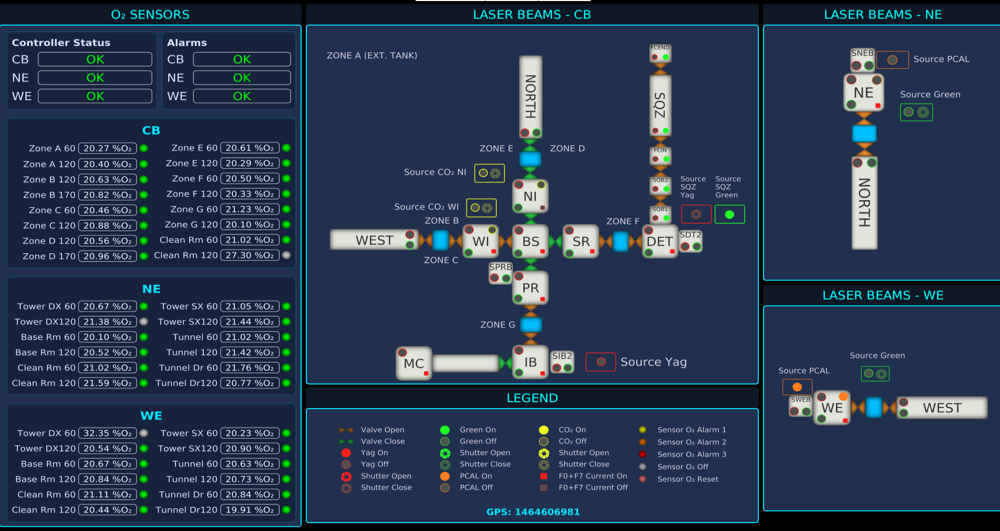
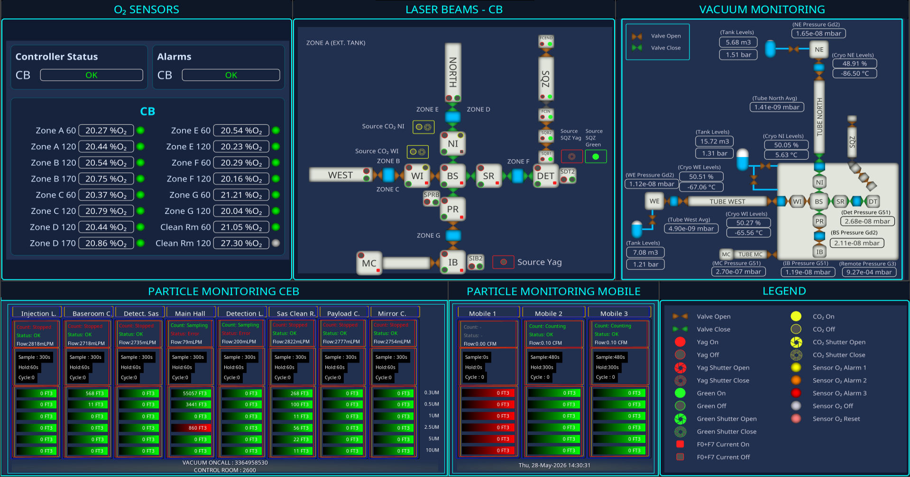
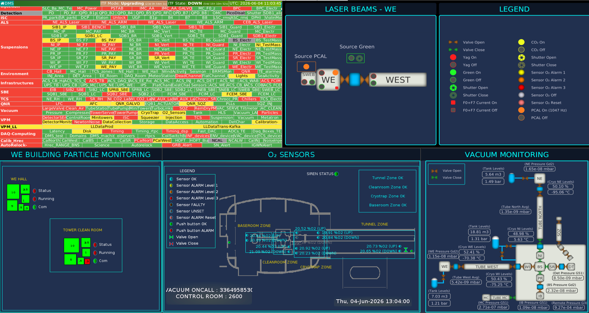
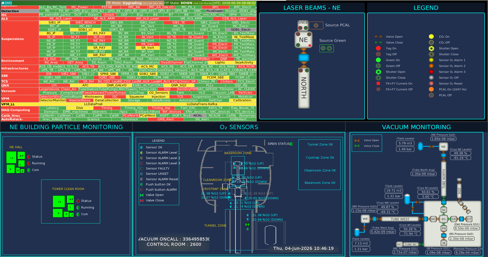
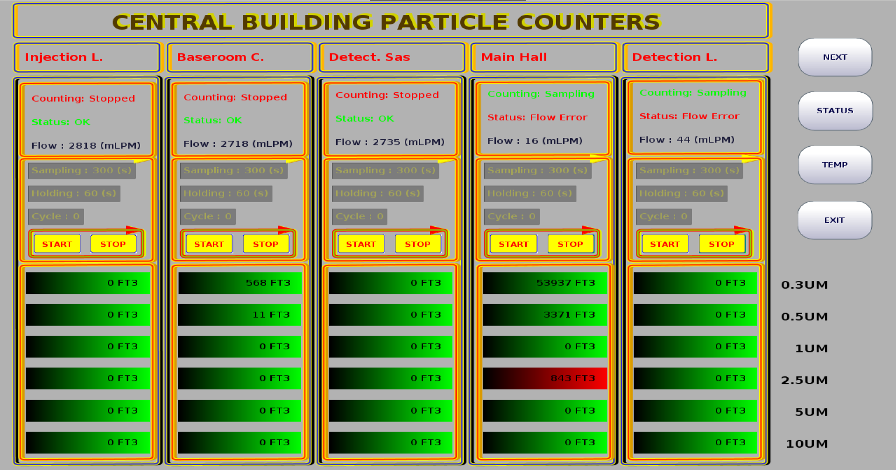
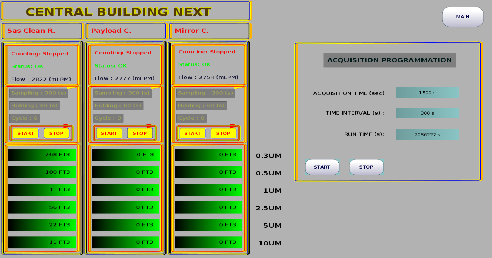
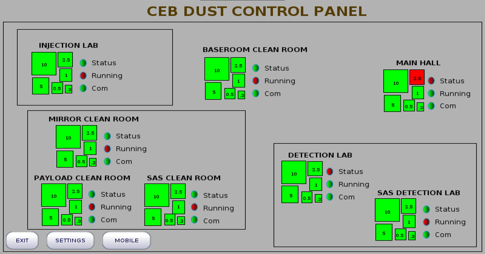

# Information Panel Displays for Virgo Operations

*Authors: D. Sentenac, A. Pasqualetti, L. Francescon*

This document describes the wall-mounted information panels and the
rack-mounted touchscreens deployed across the
Virgo site to give operators, shift personnel and visiting staff a
real-time view of the detector environment (O₂, vacuum, lasers, particle
counters). It does not define any safety procedure: it explains what each
panel shows, where it is installed and how to read its indicators, so that
the information presented on screen is unambiguous to every user.

Information panels are large wall-mounted **read-only** displays that expose
the current state of the Virgo detector to operators and visiting staff. Two
panel families are in use:

- a **global Control Room panel**, and
- the **local building panels** (Central Building, West End, North End,
  and a dedicated panel for the 1500W clean room).

A separate, smaller family of **touchscreen** displays is mounted in each
fixed particle-counting rack and is used to adjust counter settings locally.
(see Section 7.2).

Each variant exposes the slice of information relevant to its physical
location.

---

## 1. Global Control Room panel

**Location:** a single instance, installed in the Virgo Control Room.

**Scope:** the entire site (Central Building, North End, West End) in a single
view. From left to right the layout is:

| Pane | Content |
| --- | --- |
| O₂ Sensors | CB / NE / WE controllers, building alarms, and per-zone %O₂ readings |
| Laser Beams – CB | Optical path through the interferometer (WEST – BS – SR – DET – IB – MC – PR – WI – NI – NORTH – SQZ, with the SDT2, SQB1/SQB2, SPRB, FCIN/FCEND sub-elements) plus the CO₂ NI/WI sources, the SQZ Yag and SQZ Green sources, the main Yag and main Green sources |
| Vacuum Monitoring | Pressure gauges and valve states along the main tubes |
| Particle Monitoring – CB and Mobile | Six size buckets (0.3 / 0.5 / 1 / 2.5 / 5 / 10 μm) for every fixed and mobile particle counter |
| Laser Beams – NE / WE | Each end terminal, its near-tower sources (Source Green and Source PCAL per end, SNEB / SWEB indicators) and the tube toward the Central Building |
| Legend | Icon meanings (see Section 6) |

Because the Control Room panel is the only one that combines all three
buildings side-by-side, it is the reference display for any cross-building
decision (starting/stopping a laser source, opening/closing a sector valve,
etc.).

**Note:** the same view rendered on the global Control Room panel is also
accessible directly at
<http://olserver134.virgo.infn.it:8081/controlroom/>, from any device.

---

## 2. Central Building local panels

**Location:** several panels are disseminated through the Central Building:

- one at the **CB entrance**,
- one in the **clean-room area** (Clean SAS),
- one in the **Clean room in the baseroom**, below the tower entrance level,
- one in the **Preparation and Washing Room** at the basement level.

**Scope:** everything that is useful to someone physically working in CB
without having to call the Control Room. The layout reuses the same widgets as
the Control Room panel but trims it to the local context:

- O₂ sensors **status and location in the Central Building**;
- Laser Beams **activity status in the Central Building**;
- Vacuum Monitoring is shown **globally**;
- Particle Monitoring shows the **eight CB clean-room counters**
  (Injection Lab, Baseroom Clean Room, Detection Lab, Main Hall, Mirror Clean
  Room, Payload Clean Room, SAS Clean Room, SAS Detection Lab) plus the three
  Mobile counters.

These panels make it possible, for example, to verify a vacuum alarm at the
entrance of CB before entering, to read the O₂ level of a specific zone
before opening a chamber, or to check the particle levels before / after
entering any clean room.

---

## 3. End-building local panels

**Location:** one panel per end, each placed in the **entrance SAS** of the
building (West End and North End).

**Scope:** identical role to the CB panels but restricted to the local end:

- the WE panel shows WE O₂ sensors, the WE laser-beam diagram (WE Source
  Green, WE Source PCAL, SWEB, tube toward CB), the WE particle counters in
  the WE clean rooms, and the WE side of the vacuum tube;
- the NE panel is the symmetric for the North End (NE Source Green, NE
  Source PCAL, SNEB, NE clean rooms, NE tube).

They are the first display a person sees when entering the building, and
therefore carry the safety-critical O₂ alarm summary, and include the
Detector Monitoring System (DMS) for global alarm information.

---

## 4. 1500W clean-room local panel

**Location:** one panel installed in the **1500W clean-room facility**, the
auxiliary cleanroom hosting the Payload, Fiber, SAS and SQZ-laboratory
preparation areas.

**Scope:** the information reported on this panel covers two complementary
aspects:

- **Particle counting in the 1500W clean rooms** — a dedicated Particle
  Monitoring pane shows the four fixed counters of the 1500W facility
  (*Payload L.*, *Fiber L.*, *Clean R. SAS*, *SQZ Lab.*), alongside the
  three Mobile counters shared with the other panels.
- **WE tower laser beams** — the WE-side O₂ sensors, WE laser-beam diagram
  and WE vacuum tube are reproduced exactly as on the WE end-building panel
  (see Section 3), so that personnel working in the 1500W cleanroom has
  the same situational awareness as the operator entering the WE building.

---

## 5. Oxygen sensors

Each building is equipped with a network of O₂ sensors that continuously
monitor the local oxygen concentration. The panels display, in real time, the
%O₂ reading of every sensor together with its health status, so that an
expert can spot a faulty channel at a glance and plan a replacement.

**Naming conventions**

- In the **Central Building** the sensors are grouped by **zones**
  (`Zone A`, `Zone B`, …, `Zone G`, plus the Clean Room) and an additional
  height suffix (`60`, `120`, `170` for the elevation in cm above the
  floor). Each zone label is also drawn on the Laser Beams – CB diagram, so
  an operator can immediately associate a reading with the physical area.
  The interferometer is divided exactly along these zones (`ZONE A` –
  `ZONE G` in CB, plus the `ZONE A (EXT. TANK)` label inside the laser
  room), and each zone is associated with the corresponding set of O₂
  sensors.
- In the **end buildings (NE and WE)** the sensors are referenced by their
  **functional location** (`Tower DX`, `Tower SX`, `Base Room`, `Tunnel`,
  `Tunnel Door`, `Clean Room`, each in two height variants).

**Alarm levels and sensor health (common to all panels)**

The following status icons are used for O₂ sensors. Three alarm levels are
reported in the legend as colour-coded
discs: "Sensor O₂ Alarm 1" (yellow), "Sensor O₂ Alarm 2" (orange) and
"Sensor O₂ Alarm 3" (red). Two additional states cover the sensor health:
"Sensor O₂ Off" (grey) for a sensor that is not powered, and "Sensor O₂
Reset" (light pink) for a sensor that has just been acknowledged.

**Building-level alert**

A **general alert per building** (CB, NE, WE) is computed by combining all
the local sensors with thresholds set by the safety experts. These alarms
are reported in various locations (CB, NE, WE, Control Room). They are
also used for the Detector Monitoring System (DMS).

**Sensor health and lifetime**

Industrial O₂ sensing cells have a finite lifetime of about **18 months**.
When a cell drifts out of specification or stops responding, the panel
shows the corresponding sensor in the `Sensor O₂ Off` (grey) or
`Sensor O₂ Reset` (light pink) state. This is the cue the experts use to
schedule a replacement before the affected zone loses coverage.

---

## 6. Laser-beam information

The Laser Beams diagram is the new central information and operations widget. It is a
schematic of the optical path going through each vacuum element drawn as
a labelled tile (cryotraps, towers, minitowers, sector valves). Around
each tile, small
status icons report the live state of the equipment driving the beam through
that section. Colour codes are uniform across the three buildings.

**Per-element indicators**

- **Source location:** every laser source is drawn on the diagram as a
  **coloured rectangle** that hosts the source's status glyphs inside it
  — a coloured disc (Yag / Green / CO₂) and/or a shutter icon. The
  position of the rectangle itself identifies *where* the source is
  physically located on the layout, while the disc and shutter inside
  report the live
  status of that source (typically **ON** and/or **SHUTTERED**, plus the
  off / unknown variants described below). This makes the source tile a
  single self-contained widget combining identity, position and state.
- **Sector valve:** orange/brown arrow pair – pointing outward = *Valve Open*,
  pointing inward (green) = *Valve Close*.
- **Yag laser:** filled red disc = *Yag On*, grey disc = *Yag Off* (main Yag,
  SQZ Yag, and per-tower variants share the same colour key).
- **Yag shutter:** red shutter glyph open / grey closed.
- **Green laser:** green disc on / grey off.
- **Green shutter:** green shutter glyph open / grey closed.
- **PCAL laser** (1047 Hz, NE / WE only): orange disc = *PCAL On*, grey disc
  with orange outline = *PCAL Off*. Drawn twice per end diagram — a Source
  PCAL disc and a tower PCAL disc; the tower disc mirrors the source state
  (see Section 6.1).
- **CO₂ heating** (used at NI, WI): yellow disc on / grey off; the
  corresponding shutter has its own open/closed glyph.
- **F0+F7 current:** red square = energised, grey square = off.

### 6.1 Channels and thresholds

The source / shutter indicators are not driven by simple booleans; each one
aggregates one or more raw channels and applies a fixed threshold. Per-tower
Yag / Green tiles inside each diagram are **propagated** from the source
states through the optical topology (across the valves), so a tile turns off
as soon as either its source or any valve on its path closes.

After discussion with the Injection, Squeezing, Payload and TCS teams, the
laser beams that shall be **switched off and/or shuttered** to ensure
complete safety for the operators during interventions were identified.
Laser-beam power is given by fast-acquisition photodiodes at the source
level: the **MAX** value of the photodiode signal is computed and compared
to a limit threshold indicating that the laser is considered **OFF** by
the sub-system experts.

**Yag main source (CB)**

| Channel | Role |
| --- | --- |
| `INJ_EIB_POUT_PD_MAX` | Injector output PD |
| `BsX_QF_DC_MAX` | BS quad-far DC |
| `BsX_QN_DC_MAX` | BS quad-near DC |

Rule: `S = sum of the three values`; `S ≥ 0.1 V → ON`, `S < 0.1 V → OFF`.

**Green main sources (WE / NE)**

| Source | Photodiode channel | Shutter channel |
| --- | --- | --- |
| WE | `ALS_WEB_PD_GREEN_MONI_CALI_MEAN` | `ALS_WEB_REL1` |
| NE | `ALS_NEB_PD_GREEN_MONI_CALI_MEAN` | `ALS_NEB_REL1` |

Rule: `ON` iff `PD ≥ 1.0` AND `REL < 0.5`; otherwise `OFF`.

**PCAL sources (NE / WE)** — photon-calibrator laser (1047 Hz)

| Source | Channel |
| --- | --- |
| NE | `PCAL_NE_laser_on_20kHz_50Hz_MAX` |
| WE | `PCAL_WE_laser_on_20kHz_50Hz_MAX` |

Rule: the channel is a 0/1 flag; `1` → ON (orange), `0` → OFF (grey). The
`_MAX` aggregate of the flag is used (zFdVac publishes the vect aggregates
configured by `ZFDIO_VECT_AGGREGATE=meanmax`, so the plain channel name is
not served); MAX is the hazard-conservative choice for an on/off flag. The
tower PCAL disc reads the same channel as the Source PCAL disc, so both
light together — no valve propagation is applied to the PCAL beam.

**CO₂ sources (WI / NI)** – the same channels also back the WI / NI tower
CO₂ indicators

| Source | Channels |
| --- | --- |
| WI | `TCS_WI_CO2_CH_PWRLAS_MEAN`, `TCS_WI_CO2_PWRLAS_MEAN` |
| NI | `TCS_NI_CO2_CH_PWRLAS_MEAN`, `TCS_NI_CO2_PWRLAS_MEAN` |

Rule: `ON` iff any channel reads `> 20 V` (test-bench threshold; the original
Virgo specification was `0.1 V` / `~10 mW`).

**CO₂ shutters**

| Shutter | Shutter channels (OR-ed) |
| --- | --- |
| WI | `TCS_CO2_REL1`, `TCS_CO2_REL2`, `TCS_CO2_REL3` |
| NI | `TCS_CO2_REL5`, `TCS_CO2_REL6`, `TCS_CO2_REL7` |

Rule: all relays `0` → CLOSED; any relay non-zero → OPEN.

**SQZ Green source (CB)**

| Channel | Threshold |
| --- | --- |
| `SQZ_SHG_Lock_Status_MAX` | `< 5.0` → ON (SHG locked); otherwise OFF |

**Note:** Yag propagation through the ITF is **not** considered for the SQZ
chain because the residual Yag power leaking from the squeezer toward the
interferometer is negligible (order of microwatts).

**SQZ Yag fast shutter (CB)** – also gates the SQZ Yag propagation

| Channel | Threshold |
| --- | --- |
| `EQB1_FAST_SHUTTER_MONI_MAX` | `> 1.0` → CLOSED (Yag OFF); `≤ 1.0` → OPEN (Yag ON) |

**Local-control F0+F7 (per tower)**

| Tower | F0 enable | F7 on |
| --- | --- | --- |
| NI / WI / BS / PR / SR | `SAT_<T>_F0_DC_ENBL` | `SAT_<T>_F7_DC_ON` |
| IB / MC | `SAT_<T>_F0_DC_ENBL` | (no F7 wired) |
| DET | `SAT_OB_F0_DC_ENBL` | (no F7 wired) |

Rule: any channel reading `1` → ON (red square); all known channels `0` →
OFF (grey square); unknown otherwise.

**Note:** these signals are exposed on the panel to inform the operator
that the suspension is in a safe condition (F0 enabled and / or F7 active),
so that local interventions on the tower can be carried out without risk of
moving the payload.

**Sector / cryo valves** (drive both the diagram glyphs and the Yag / Green
propagation)

| Group | Channels |
| --- | --- |
| SQZ chain | `VAC_SQZ300N_VPST`, `VAC_SQZ0N_VPST`, `VAC_SQZDET2_VPST`, `VAC_SQZDET1_VPST` |
| Big sector | `VAC_VALVEBIGNI_ST`, `VAC_VALVEBIGWI_ST` |
| Central manifold | `VAC_VALVECENTRAL_VLIST`, `VAC_VALVECENTRAL_VNSST`, `VAC_VALVECENTRAL_VWSST`, `VAC_VALVECENTRAL_VPSST`, `VAC_VALVECENTRAL_VSSST` |
| Cryotrap | `VAC_CRYONI_VCRYOST`, `VAC_CRYOWI_VCRYOST` |
| Cryo-link | `VAC_CRYOLINKIB_Vs1`, `VAC_CRYOLINKIB_Vs2`, `VAC_CRYOLINKDET_Vs1`, `VAC_CRYOLINKDET_Vs2` |
| End valves (propagation only, not rendered on CB) | `VAC_VALVEBIGWE_ST`, `VAC_CRYOWE_VCRYOST`, `VAC_VALVEBIGNE_ST`, `VAC_CRYONE_VCRYOST` |

Each valve channel uses the standard `VPST` / `ST` convention from the vacuum
SCADA: `1` → OPEN (orange "valve open" glyph), `0` → CLOSED (green "valve
close" glyph), any other code → unknown grey.

**Note:** both the **Cryo-link** valves and the **SQZ chain** valves are
optically **transparent to the beams** even when CLOSED — they are fitted
with a viewport, so they isolate the vacuum sectors without interrupting the
Yag or Green propagation. They are reported on the diagram for vacuum-state
awareness only and are skipped by the laser-propagation logic.

---

## 7. Particle counting

The Virgo clean rooms are continuously sampled by stationary particle counters
that report six size buckets (0.3 / 0.5 / 1 / 2.5 / 5 / 10 μm). On the panels
the readings are displayed as **absolute values** per size. A **threshold for
each size class** can be set on the rack display and is managed by the
clean-team experts. The bar associated with each value is green when the
reading is below threshold, yellow / red when the limit for that size class
is exceeded. An alarm associated with each threshold is transmitted to the
DMS.

### 7.1 Operator presence in the tower

When operators have to intervene inside a tower, the dust budget of the
corresponding clean room temporarily grows (door cycles, garment changes,
tooling). The fixed counter may tend to oscillate and trigger alarms if the
threshold acceptance is overpassed. The accepted procedure is therefore:

1. **Adjust the acquisition settings** of the affected fixed counters before
   entering the tower. The "CENTRAL BUILDING NEXT" view exposes the
   *Acquisition Time*, *Time Interval* and *Run Time* parameters, plus a
   *Start* / *Stop* couple. During an intervention the counters are set with
   a **longer counting (acquisition) time** and a **shorter holding time**,
   so that the actual dust generated by the activity is sampled more
   frequently and is not masked by long idle intervals between counts.
2. **Deploy a Mobile particle counter** next to the intervention point. The
   three Mobile counters (Mobile 1 / Mobile 2 / Mobile 3) are displayed in
   their own pane, in parallel with the fixed ones, and provide the
   short-term value the operator can use to decide whether to continue or
   pause.
3. **Revert the fixed counter settings** at the end of the intervention.

### 7.2 Rack-mounted and remote display touchscreens (Particle counters information and settings)

Unlike the wall-mounted information panels, which are read-only, each
particle-counting rack is fitted with a **small touchscreen display** mounted
at the rack itself. These touchscreens are meant to adjust
particle counter settings in the field:

- they limit the scope to the counters served by that rack,
- they expose the start / stop controls and the acquisition parameters
  (*Acquisition Time*, *Time Interval*, *Run Time*),
- they provide the navigation buttons visible on the bottom row of the
  "CENTRAL BUILDING PARTICLE COUNTERS" and "CEB DUST CONTROL PANEL" views
  (MAIN, NEXT, STATUS, TEMP, EXIT, SETTINGS, MOBILE).

They are the direct way to reach a single counter when the operator is in
the corresponding area; the wall-mounted displays in the CB, the ends and
the Control Room only show the resulting values.

Two other small touchscreen displays are placed in the Clean Room SAS,
and the Detection SAS. They allow remote access to Central Building rack interface.

---

## 8. Summary of deployment

| Panel | Physical location(s) | Buildings covered |
| --- | --- | --- |
| Global Control Room panel | Control Room (single instance) | CB + NE + WE |
| Central Building local panels | CB entrance, Clean SAS, Baseroom (below tower entrance level) | CB |
| WE local panel | WE entrance SAS | WE |
| NE local panel | NE entrance SAS | NE |
| 1500W clean-room panel | 1500W clean-room facility | 1500W clean rooms (Payload L., Fiber L., Clean R. SAS, SQZ Lab.) + WE-side O₂ & laser overview |
| Rack-mounted and remote display touchscreens (Particle counters information and settings) | One rack per building: CB in the pure water production room, NE in the main hall, WE in the main hall; remote touchscreens in CB Main Clean Room SAS and DET SAS | Only the counters served by the rack |

---

## 9. Conclusion

The panels report, as a first priority, **real-time information** aimed at
helping operators to work in a safe environment when entering the
experimental areas. They cover several complementary aspects of the
detector environment — **vacuum**, **laser beams**, **oxygen sensors** and
**particle-counting states** — so that the user has a single, coherent
view of what is happening locally before stepping into a clean room or
opening a chamber.

The various thresholds shown on the panels (pressure, laser power, oxygen
levels, particle counts) may **evolve over time** according to the
expertise of the sub-system teams; the panels are therefore intended as a
living reference of the current operating conditions, kept in sync with
the up-to-date thresholds defined by the responsible experts.
