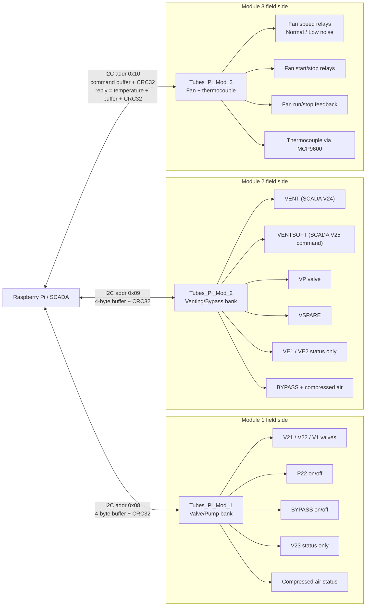
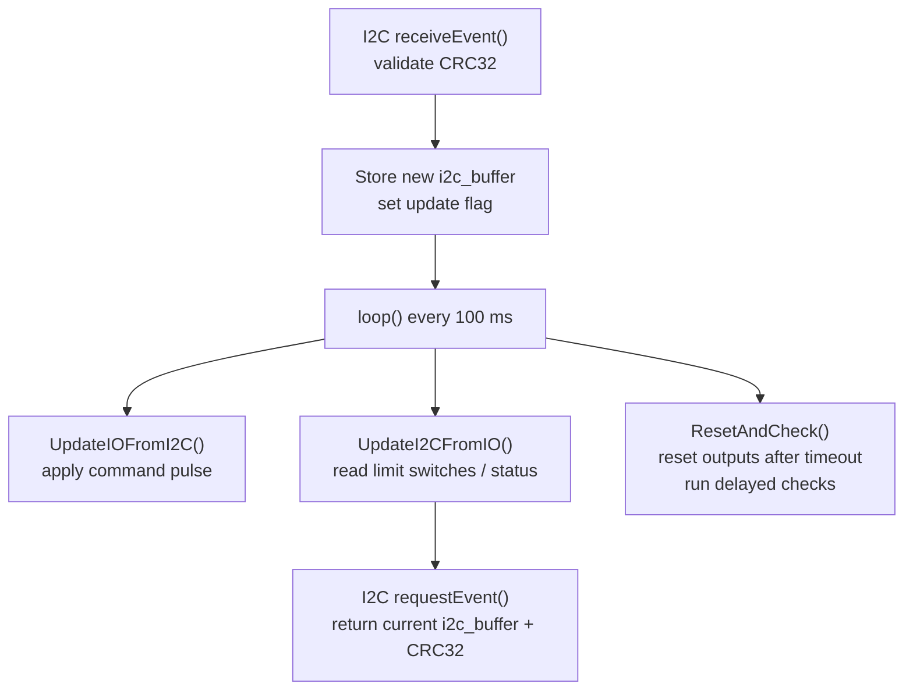
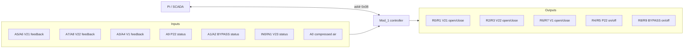
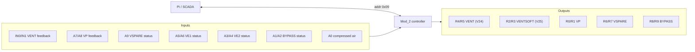
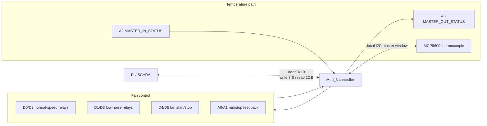

# Tubes_Pi_Mod_1 / 2 / 3 Technical Schema

This note summarizes the implemented behavior of the three `Tubes_Pi_Mod_*` sketches from the code, with the SCADA-side names taken from the corresponding Java wrappers.

Scope:

- `modules/Tubes_Pi_Mod_1/Tubes_Pi_Mod_1.ino`
- `modules/Tubes_Pi_Mod_2/Tubes_Pi_Mod_2.ino`
- `modules/Tubes_Pi_Mod_3/Tubes_Pi_Mod_3.ino`
- `work_link/Controllino_1.java`
- `work_sqz/Controllino_2.java`
- `work_link/Controllino_3.java`

The diagrams below describe the code as implemented, not a reconstructed plant P&ID.

## 1. Overall Architecture

## 2. Shared Pattern in Mod_1 and Mod_2

`Mod_1` and `Mod_2` use the same control architecture:

- each board is an I2C slave exposing one 32-bit `i2c_buffer`
- the Pi writes `4 data bytes + 4 CRC32 bytes`
- the module replies with `4 data bytes + 4 CRC32 bytes`
- the buffer mixes command bits and status bits
- most actuators are pulse-driven, not permanently latched

Runtime flow:

Command encoding pattern for valves and on/off devices:

- idle state is usually `open/on bit = 0`, `close/off bit = 1`
- open/on command is triggered by setting the open/on bit, so the pair becomes `11`
- close/off command is triggered by clearing the close/off bit, so the pair becomes `00`
- after the pulse timeout, the sketch restores the bits to the idle pattern

Timing:

- `Mod_1`: `2 s` pulse reset for valves and bypass, `5 s` for `P22`, `10 s` delayed check
- `Mod_2`: `2 s` pulse reset, `10 s` delayed check

## 3. Module 1: `Tubes_Pi_Mod_1`

Role:

- primary valve/pump module
- I2C slave address `0x08`
- SCADA wrapper: `Controllino_1`

### 3.1 Functional Map

| Function | Type | Controllino I/O | Buffer bits | SCADA names |
| --- | --- | --- | --- | --- |
| `V21` | command + feedback | `R0/R1`, `A5/A6` | `0..3` | `V21CMD`, `V21ST` |
| `V22` | command + feedback | `R2/R3`, `A7/A8` | `4..7` | `V22CMD`, `V22ST` |
| `V1` | command + feedback | `R6/R7`, `A3/A4` | `8..11` | `V1CMD`, `V1ST` |
| `BYPASS` | on/off + feedback | `R8/R9`, `A1/A2` | `12..15` | `BYPASSONOFF`, `BYPASSST` |
| `P22` | on/off + single status | `R4/R5`, `A9` | `16..18` | `P22ONOFF`, `P22ST` |
| `V23` | status only | `IN0/IN1` | `19..20` | `V23ST` |
| `COMPRESSAIR` | status only | `A0` | `21` | `COMPRESSAIRST` |
| MCU reset | control only | none | `31` | internal reset bit |

### 3.2 Behavior

- `V21`, `V22`, `V1` are bi-directional valve outputs with open/close end-switch feedback.
- `P22` is a single on/off actuator with one status input.
- `BYPASS` is a two-state actuator with separate on/off feedback.
- `V23` and `COMPRESSAIR` are read-only status sources.

SCADA-side interpretation in the Java wrapper:

- valves: `1=open`, `2=closed`, `0=moving/unknown`
- bypass: `1=on`, `2=off`, `0=error`
- `P22`: `1=on`, `0=off`
- compressed air: `0=ok`, `1=ko`

### 3.3 Module 1 Sketch

## 4. Module 2: `Tubes_Pi_Mod_2`

Role:

- venting / transfer valve module
- I2C slave address `0x09`
- SCADA wrapper: `Controllino_2`

Naming note:

- in the sketch, the two main commanded valves are `VENT` and `VENTSOFT`
- in the Java wrapper, these are exposed as `V24` and `V25`

### 4.1 Functional Map

| Function | Type | Controllino I/O | Buffer bits | SCADA names |
| --- | --- | --- | --- | --- |
| `VENT` | command + feedback | `R4/R5`, `IN0/IN1` | `0..3` | `V24CMD`, `V24ST` |
| `VENTSOFT` | command only | `R2/R3` | `4..5` | `V25CMD` |
| `VP` | command + feedback | `R0/R1`, `A7/A8` | `6..9` | `VPCMD`, `VPST` |
| `BYPASS` | on/off + feedback | `R8/R9`, `A1/A2` | `10..13` | `BYPASSONOFF`, `BYPASSST` |
| `VSPARE` | on/off + single status | `R6/R7`, `A9` | `14..16` | `VSPAREONOFF`, `VSPAREST` |
| `VE1` | status only | `A5/A6` | `17..18` | `VE1ST` |
| `VE2` | status only | `A3/A4` | `19..20` | `VE2ST` |
| `COMPRESSAIR` | status only | `A0` | `21` | `COMPRESSAIRST` |
| MCU reset | control only | none | `31` | internal reset bit |

### 4.2 Behavior

- `VENT` (`V24`) behaves like the valve channels in `Mod_1`.
- `VENTSOFT` (`V25`) is commandable but has no dedicated feedback bits in the exported status map.
- `VP` is a valve with open/close feedback.
- `VSPARE` is a single-bit open/close device.
- `VE1` and `VE2` are status-only valves.

SCADA-side interpretation in the Java wrapper:

- `V24ST`, `VPST`, `VE1ST`, `VE2ST`: `1=open`, `2=closed`, `0=moving/unknown`
- `VSPAREST`: `1=open/on`, `2=closed/off`
- `BYPASSST`: `1=on`, `2=off`, `0=error`
- `COMPRESSAIRST`: `0=ok`, `1=ko`

### 4.3 Module 2 Sketch

## 5. Module 3: `Tubes_Pi_Mod_3`

Role:

- rack support module
- I2C slave address `0x10`
- controls fan speed and fan on/off
- reads a thermocouple through an `MCP9600`
- SCADA wrapper: `Controllino_3`

Key difference from `Mod_1` and `Mod_2`:

- the reply payload is larger
- the module is both:
  - an I2C slave toward the Raspberry Pi
  - a temporary local I2C master when polling the thermocouple

### 5.1 Reply Format

`requestEvent()` returns:

1. `4 bytes` temperature as IEEE-754 float
2. `4 bytes` status/command buffer
3. `4 bytes` CRC32 over the previous `8` bytes

So the Pi reads `12 bytes` total from `Mod_3`.

### 5.2 Functional Map

| Function | Type | Controllino I/O | Buffer bits | SCADA names |
| --- | --- | --- | --- | --- |
| normal-speed relay path | command state | `D0/D2` | `0..1` | part of `FANSPEED` |
| low-noise relay path | command state | `D1/D3` | `2..3` | part of `FANSPEED` |
| fan start/stop | command + feedback | `D4/D5`, `A0/A1` | `4..7` | `FANONOFF`, `FANST` |
| board reset | control only | none | `8` | internal reset bit |
| thermocouple temperature | measurement | local MCP9600 | separate float payload | `TEMP` |
| local bus arbitration | coordination | `A2/A3` | not exported | internal only |

### 5.3 Behavior

Startup state:

- fan speed defaults to `normal speed`
- fan defaults to `stopped`

Fan speed logic:

- `FANSPEED = 1` means steady normal-speed relay state
- `FANSPEED = 2` means steady low-noise relay state
- `FANSPEED = 0` means transition / inconsistent state

The speed change is not a single relay pulse. The sketch performs a two-step relay sequence with two timers:

- command low-noise by changing the normal-speed bit pattern
- command normal-speed by changing the low-noise bit pattern
- `ResetAndCheck()` completes the second half of the relay handover

Fan on/off logic:

- start fan by setting `FAN_START_CMD_BIT`
- stop fan by clearing `FAN_STOP_CMD_BIT`
- output pulse is reset after `2 s`

Temperature logic:

- every `5 s`, if `MASTER_IN_STATUS` says the local sensor bus is free, the sketch asserts `MASTER_OUT_STATUS`
- if the bus is still free after a short delay, it reads the `MCP9600`
- the new value is accepted if it is the first read or if the delta is below `20 C`

SCADA-side interpretation in the Java wrapper:

- `FANST`: `1=on`, `2=off`, `0=error`
- `FANSPEED`: `1=normal`, `2=low noise`, `0=transition/error`
- `TEMP`: float value from the first 4 bytes of the reply

### 5.4 Module 3 Sketch

## 6. Compact Comparison

| Module | Address | Main job | Reply payload | Main controlled equipment |
| --- | --- | --- | --- | --- |
| `Mod_1` | `0x08` | valve/pump bank | `buffer + CRC32` | `V21`, `V22`, `V1`, `P22`, `BYPASS` |
| `Mod_2` | `0x09` | venting/bypass bank | `buffer + CRC32` | `VENT/V24`, `VENTSOFT/V25`, `VP`, `VSPARE`, `BYPASS` |
| `Mod_3` | `0x10` | fan + rack temperature | `float temp + buffer + CRC32` | fan speed, fan on/off, thermocouple |

## 7. Practical Reading of the Three Modules

At system level the three modules split responsibilities like this:

- `Mod_1` = main vacuum-side valve bank with one pump/stage output
- `Mod_2` = venting-side valve bank and bypass branch
- `Mod_3` = rack utility module for fan management and local temperature readback

If needed, this document can be converted into:

- a single SVG block diagram for the repository
- one page per module with full signal truth tables
- or a plant-oriented diagram that maps `V21/V22/...` to the vacuum line nomenclature used in the UI
