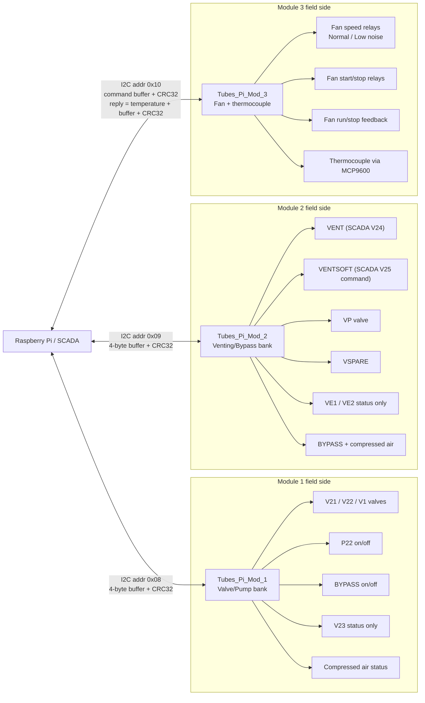
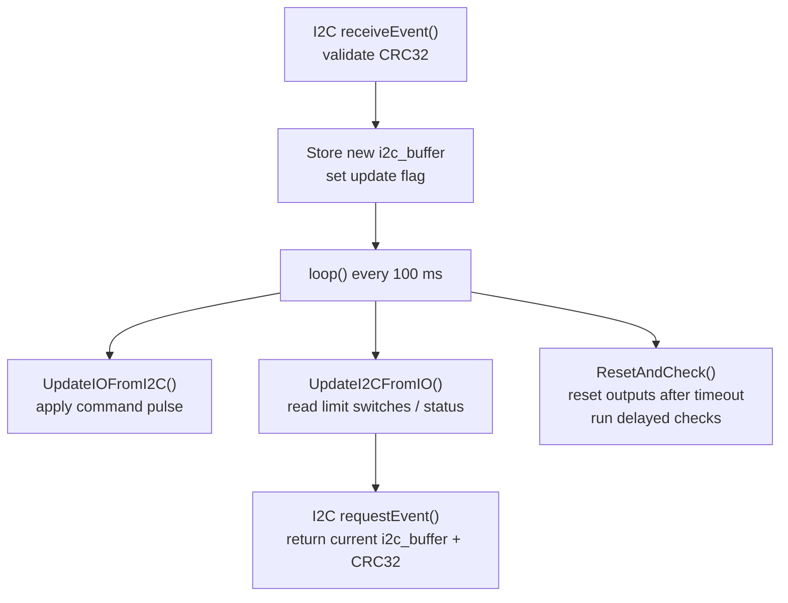
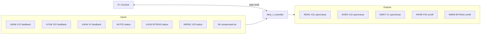
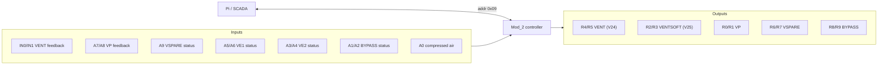
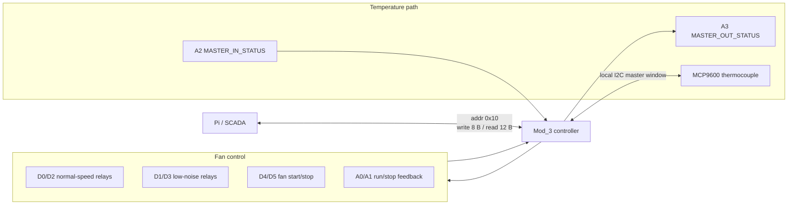
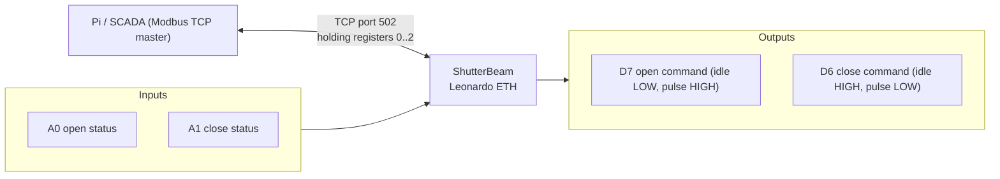

# Tubes_Pi_Mod_1 / 2 / 3, IONIC and ShutterBeam Technical Schema

This note summarizes the implemented behavior of the three `Tubes_Pi_Mod_*` sketches from the code, with the SCADA-side names taken from the corresponding Java wrappers. Section 6 documents the `ShutterBeam` module, which reuses the `Mod_1` valve control scheme but over Modbus TCP instead of I2C. Section 7 documents `Tubes_Pi_Mod_1_IONIC`, the status-only variant used by the ion pumping station (`work_ionic`), together with that station's RS485 links.

Scope:

- `modules/Tubes_Pi_Mod_1/Tubes_Pi_Mod_1.ino`
- `modules/Tubes_Pi_Mod_2/Tubes_Pi_Mod_2.ino`
- `modules/Tubes_Pi_Mod_3/Tubes_Pi_Mod_3.ino`
- `modules/ShutterBeam/ShutterBeam.ino`
- `modules/Tubes_Pi_Mod_1_IONIC/Tubes_Pi_Mod_1_IONIC.ino`
- `work_link/Controllino_1.java`
- `work_sqz/Controllino_2.java`
- `work_link/Controllino_3.java`
- `work_ionic/Controllino.java`, `work_ionic/IonicAgilentIPCMini.java`, `work_ionic/MaxiGauge.java`

The diagrams below describe the code as implemented, not a reconstructed plant P&ID.

## 1. Overall Architecture


```mermaid
flowchart LR
    PI["Raspberry Pi / SCADA"]

    PI <-->|I2C addr 0x08<br/>4-byte buffer + CRC32| M1["Tubes_Pi_Mod_1<br/>Valve/Pump bank"]
    PI <-->|I2C addr 0x09<br/>4-byte buffer + CRC32| M2["Tubes_Pi_Mod_2<br/>Venting/Bypass bank"]
    PI <-->|I2C addr 0x10<br/>command buffer + CRC32<br/>reply = temperature + buffer + CRC32| M3["Tubes_Pi_Mod_3<br/>Fan + thermocouple"]

    subgraph M1I["Module 1 field side"]
      M1 --> M1A["V21 / V22 / V1 valves"]
      M1 --> M1B["P22 on/off"]
      M1 --> M1C["BYPASS on/off"]
      M1 --> M1D["V23 status only"]
      M1 --> M1E["Compressed air status"]
    end

    subgraph M2I["Module 2 field side"]
      M2 --> M2A["VENT (SCADA V24)"]
      M2 --> M2B["VENTSOFT (SCADA V25 command)"]
      M2 --> M2C["VP valve"]
      M2 --> M2D["VSPARE"]
      M2 --> M2E["VE1 / VE2 status only"]
      M2 --> M2F["BYPASS + compressed air"]
    end

    subgraph M3I["Module 3 field side"]
      M3 --> M3A["Fan speed relays<br/>Normal / Low noise"]
      M3 --> M3B["Fan start/stop relays"]
      M3 --> M3C["Fan run/stop feedback"]
      M3 --> M3D["Thermocouple via MCP9600"]
    end
```

## 2. Shared Pattern in Mod_1 and Mod_2

`Mod_1` and `Mod_2` use the same control architecture:

- each board is an I2C slave exposing one 32-bit `i2c_buffer`
- the Pi writes `4 data bytes + 4 CRC32 bytes`
- the module replies with `4 data bytes + 4 CRC32 bytes`
- the buffer mixes command bits and status bits
- most actuators are pulse-driven, not permanently latched

Runtime flow:


```mermaid
flowchart TD
    A["I2C receiveEvent()<br/>validate CRC32"] --> B["Store new i2c_buffer<br/>set update flag"]
    B --> C["loop() every 100 ms"]
    C --> D["UpdateIOFromI2C()<br/>apply command pulse"]
    C --> E["UpdateI2CFromIO()<br/>read limit switches / status"]
    C --> F["ResetAndCheck()<br/>reset outputs after timeout<br/>run delayed checks"]
    E --> G["I2C requestEvent()<br/>return current i2c_buffer + CRC32"]
```

Command encoding pattern for valves and on/off devices:

- idle state is usually `open/on bit = 0`, `close/off bit = 1`
- open/on command is triggered by setting the open/on bit, so the pair becomes `11`
- close/off command is triggered by clearing the close/off bit, so the pair becomes `00`
- after the pulse timeout, the sketch restores the bits to the idle pattern

Timing:

- `Mod_1`: `2 s` pulse reset for valves and bypass, `5 s` for `P22`, `10 s` delayed check
- `Mod_2`: `2 s` pulse reset, `10 s` delayed check

## 3. Module 1: `Tubes_Pi_Mod_1`

Role:

- primary valve/pump module
- I2C slave address `0x08`
- SCADA wrapper: `Controllino_1`

### 3.1 Functional Map

| Function | Type | Controllino I/O | Buffer bits | SCADA names |
| --- | --- | --- | --- | --- |
| `V21` | command + feedback | `R0/R1`, `A5/A6` | `0..3` | `V21CMD`, `V21ST` |
| `V22` | command + feedback | `R2/R3`, `A7/A8` | `4..7` | `V22CMD`, `V22ST` |
| `V1` | command + feedback | `R6/R7`, `A3/A4` | `8..11` | `V1CMD`, `V1ST` |
| `BYPASS` | on/off + feedback | `R8/R9`, `A1/A2` | `12..15` | `BYPASSONOFF`, `BYPASSST` |
| `P22` | on/off + single status | `R4/R5`, `A9` | `16..18` | `P22ONOFF`, `P22ST` |
| `V23` | status only | `IN0/IN1` | `19..20` | `V23ST` |
| `COMPRESSAIR` | status only | `A0` | `21` | `COMPRESSAIRST` |
| MCU reset | control only | none | `31` | internal reset bit |

### 3.2 Behavior

- `V21`, `V22`, `V1` are bi-directional valve outputs with open/close end-switch feedback.
- `P22` is a single on/off actuator with one status input.
- `BYPASS` is a two-state actuator with separate on/off feedback.
- `V23` and `COMPRESSAIR` are read-only status sources.

SCADA-side interpretation in the Java wrapper:

- valves: `1=open`, `2=closed`, `0=moving/unknown`
- bypass: `1=on`, `2=off`, `0=error`
- `P22`: `1=on`, `0=off`
- compressed air: `0=ok`, `1=ko`

### 3.3 Module 1 Sketch


```mermaid
flowchart LR
    PI["Pi / SCADA"] <-->|addr 0x08| M1["Mod_1 controller"]

    subgraph OUT1["Outputs"]
      O11["R0/R1 V21 open/close"]
      O12["R2/R3 V22 open/close"]
      O13["R6/R7 V1 open/close"]
      O14["R4/R5 P22 on/off"]
      O15["R8/R9 BYPASS on/off"]
    end

    subgraph IN1["Inputs"]
      I11["A5/A6 V21 feedback"]
      I12["A7/A8 V22 feedback"]
      I13["A3/A4 V1 feedback"]
      I14["A9 P22 status"]
      I15["A1/A2 BYPASS status"]
      I16["IN0/IN1 V23 status"]
      I17["A0 compressed air"]
    end

    M1 --> OUT1
    IN1 --> M1
```

## 4. Module 2: `Tubes_Pi_Mod_2`

Role:

- venting / transfer valve module
- I2C slave address `0x09`
- SCADA wrapper: `Controllino_2`

Naming note:

- in the sketch, the two main commanded valves are `VENT` and `VENTSOFT`
- in the Java wrapper, these are exposed as `V24` and `V25`

### 4.1 Functional Map

| Function | Type | Controllino I/O | Buffer bits | SCADA names |
| --- | --- | --- | --- | --- |
| `VENT` | command + feedback | `R4/R5`, `IN0/IN1` | `0..3` | `V24CMD`, `V24ST` |
| `VENTSOFT` | command only | `R2/R3` | `4..5` | `V25CMD` |
| `VP` | command + feedback | `R0/R1`, `A7/A8` | `6..9` | `VPCMD`, `VPST` |
| `BYPASS` | on/off + feedback | `R8/R9`, `A1/A2` | `10..13` | `BYPASSONOFF`, `BYPASSST` |
| `VSPARE` | on/off + single status | `R6/R7`, `A9` | `14..16` | `VSPAREONOFF`, `VSPAREST` |
| `VE1` | status only | `A5/A6` | `17..18` | `VE1ST` |
| `VE2` | status only | `A3/A4` | `19..20` | `VE2ST` |
| `COMPRESSAIR` | status only | `A0` | `21` | `COMPRESSAIRST` |
| MCU reset | control only | none | `31` | internal reset bit |

### 4.2 Behavior

- `VENT` (`V24`) behaves like the valve channels in `Mod_1`.
- `VENTSOFT` (`V25`) is commandable but has no dedicated feedback bits in the exported status map.
- `VP` is a valve with open/close feedback.
- `VSPARE` is a single-bit open/close device.
- `VE1` and `VE2` are status-only valves.

SCADA-side interpretation in the Java wrapper:

- `V24ST`, `VPST`, `VE1ST`, `VE2ST`: `1=open`, `2=closed`, `0=moving/unknown`
- `VSPAREST`: `1=open/on`, `2=closed/off`
- `BYPASSST`: `1=on`, `2=off`, `0=error`
- `COMPRESSAIRST`: `0=ok`, `1=ko`

### 4.3 Module 2 Sketch


```mermaid
flowchart LR
    PI["Pi / SCADA"] <-->|addr 0x09| M2["Mod_2 controller"]

    subgraph OUT2["Outputs"]
      O21["R4/R5 VENT (V24)"]
      O22["R2/R3 VENTSOFT (V25)"]
      O23["R0/R1 VP"]
      O24["R6/R7 VSPARE"]
      O25["R8/R9 BYPASS"]
    end

    subgraph IN2["Inputs"]
      I21["IN0/IN1 VENT feedback"]
      I22["A7/A8 VP feedback"]
      I23["A9 VSPARE status"]
      I24["A5/A6 VE1 status"]
      I25["A3/A4 VE2 status"]
      I26["A1/A2 BYPASS status"]
      I27["A0 compressed air"]
    end

    M2 --> OUT2
    IN2 --> M2
```

## 5. Module 3: `Tubes_Pi_Mod_3`

Role:

- rack support module
- I2C slave address `0x10`
- controls fan speed and fan on/off
- reads a thermocouple through an `MCP9600`
- SCADA wrapper: `Controllino_3`

Key difference from `Mod_1` and `Mod_2`:

- the reply payload is larger
- the module is both:
  - an I2C slave toward the Raspberry Pi
  - a temporary local I2C master when polling the thermocouple

### 5.1 Reply Format

`requestEvent()` returns:

1. `4 bytes` temperature as IEEE-754 float
2. `4 bytes` status/command buffer
3. `4 bytes` CRC32 over the previous `8` bytes

So the Pi reads `12 bytes` total from `Mod_3`.

### 5.2 Functional Map

| Function | Type | Controllino I/O | Buffer bits | SCADA names |
| --- | --- | --- | --- | --- |
| normal-speed relay path | command state | `D0/D2` | `0..1` | part of `FANSPEED` |
| low-noise relay path | command state | `D1/D3` | `2..3` | part of `FANSPEED` |
| fan start/stop | command + feedback | `D4/D5`, `A0/A1` | `4..7` | `FANONOFF`, `FANST` |
| board reset | control only | none | `8` | internal reset bit |
| thermocouple temperature | measurement | local MCP9600 | separate float payload | `TEMP` |
| local bus arbitration | coordination | `A2/A3` | not exported | internal only |

### 5.3 Behavior

Startup state:

- fan speed defaults to `normal speed`
- fan defaults to `stopped`

Fan speed logic:

- `FANSPEED = 1` means steady normal-speed relay state
- `FANSPEED = 2` means steady low-noise relay state
- `FANSPEED = 0` means transition / inconsistent state

The speed change is not a single relay pulse. The sketch performs a two-step relay sequence with two timers:

- command low-noise by changing the normal-speed bit pattern
- command normal-speed by changing the low-noise bit pattern
- `ResetAndCheck()` completes the second half of the relay handover

Fan on/off logic:

- start fan by setting `FAN_START_CMD_BIT`
- stop fan by clearing `FAN_STOP_CMD_BIT`
- output pulse is reset after `2 s`

Temperature logic:

- every `5 s`, if `MASTER_IN_STATUS` says the local sensor bus is free, the sketch asserts `MASTER_OUT_STATUS`
- if the bus is still free after a short delay, it reads the `MCP9600`
- the new value is accepted if it is the first read or if the delta is below `20 C`

SCADA-side interpretation in the Java wrapper:

- `FANST`: `1=on`, `2=off`, `0=error`
- `FANSPEED`: `1=normal`, `2=low noise`, `0=transition/error`
- `TEMP`: float value from the first 4 bytes of the reply

### 5.4 Module 3 Sketch


```mermaid
flowchart LR
    PI["Pi / SCADA"] <-->|addr 0x10<br/>write 8 B / read 12 B| M3["Mod_3 controller"]

    subgraph FAN["Fan control"]
      F1["D0/D2 normal-speed relays"]
      F2["D1/D3 low-noise relays"]
      F3["D4/D5 fan start/stop"]
      F4["A0/A1 run/stop feedback"]
    end

    subgraph TEMP["Temperature path"]
      B1["A2 MASTER_IN_STATUS"]
      B2["A3 MASTER_OUT_STATUS"]
      T1["MCP9600 thermocouple"]
    end

    M3 --> FAN
    FAN --> M3
    M3 --> B2
    B1 --> M3
    M3 <-->|local I2C master window| T1
```

## 6. ShutterBeam: beam shutter (Modbus TCP)

Role:

- single beam-shutter actuator, modeled as a valve
- **not** an I2C/Controllino board: it is an Arduino **Leonardo ETH** acting as a **Modbus TCP slave** on port `502`
- reproduces the `V21` valve open/close scheme of `Mod_1` (pulse + `ResetAndCheck` + delayed check), but exposes it through Modbus holding registers instead of I2C buffer bits
- SCADA rack file: `/virgoData/Vacuum/racks/SHUTTERBEAM1.cfg` (parent `VAC_SHUTTERBEAM1`)
- network: DHCP with a `15 s` timeout, then static fallback `192.168.224.190` (`shutterbeam1`); MAC `96:A2:DA:10:5F:D3`
- library: `ModbusTCPSlave` from `arduino-Tools40`

### 6.1 Functional Map

| Function | Type | Arduino I/O | Holding register | SCADA name |
| --- | --- | --- | --- | --- |
| shutter status | feedback | `A0` open, `A1` close | `0` | `_SHUTTERST` |
| shutter command | command | `D7` open, `D6` close | `1` | `_SHUTTERCMD` |
| MCU reset | control only | none | `2` | `_RESETARD` |

Register values (same convention as the `Mod_1` valves):

- `_SHUTTERST`: `1=open` (`A0=1,A1=0`), `2=closed` (`A0=0,A1=1`), `0=moving/unknown`
- `_SHUTTERCMD`: `1=open`, `2=close`, `0=idle`

### 6.2 Behavior

Wiring / initialization (from the schematic):

- `D7` = open command, idle `LOW`; open = pulse `HIGH`
- `D6` = close command, idle `HIGH`; close = pulse `LOW`

Command handling reuses the `V21` state machine of `Mod_1`:

- a write to `_SHUTTERCMD` is detected by watching the register for a change; because Modbus TCP has no receive interrupt, this replaces the I2C `receiveEvent` that sets `updateIOFromI2CBool` in `Mod_1`
- `UpdateIOFromModbus()` starts the D6/D7 pulse and arms `SHUTTER_RESET`
- `ResetAndCheck()` ends the pulse and clears the command register after `reset_wait = 2 s`; after an open it arms `SHUTTER_CHECK` and, if the shutter still reads closed after `check_wait = 10 s`, re-issues a close
- `UpdateModbusFromIO()` derives the status from `A0/A1` and re-issues a close if the shutter drifts from open to closed

The runtime flow mirrors the shared pattern in Section 2, with `modbus.update()` in place of the I2C receive/request events.

### 6.3 ShutterBeam Sketch


```mermaid
flowchart LR
    PI["Pi / SCADA (Modbus TCP master)"] <-->|TCP port 502<br/>holding registers 0..2| SB["ShutterBeam<br/>Leonardo ETH"]

    subgraph OUTSB["Outputs"]
      OSB1["D7 open command (idle LOW, pulse HIGH)"]
      OSB2["D6 close command (idle HIGH, pulse LOW)"]
    end

    subgraph INSB["Inputs"]
      ISB1["A0 open status"]
      ISB2["A1 close status"]
    end

    SB --> OUTSB
    INSB --> SB
```

## 7. Module 1 IONIC: `Tubes_Pi_Mod_1_IONIC` (work_ionic)

Role:

- valve status module of the ion pumping station (first deployed on `vactube900n`, GUI title `TUBE 900 NORTH`)
- board: **Controllino MINI** (ATmega328P), unlike the MAXI used by the other modules
- I2C slave address `0x08`, same `4 data bytes + 4 CRC32 bytes` reply as `Mod_1`
- **status only**: all valve commands are commented out in the sketch and in `work_ionic/Controllino.java`
- SCADA wrapper: `work_ionic/Controllino.java` (device name `I2C`)

### 7.1 Functional Map

| Function | Type | Controllino I/O | Buffer bits | SCADA names |
| --- | --- | --- | --- | --- |
| `V31` | status only | `A2` open, `A3` close | `4..5` | `I2C_V31ST` |
| `V32` | status only | `A0` open, `A1` close | `6..7` | `I2C_V32ST` |
| `VSPARE` | status only | `IN0` open, `IN1` close | `8..9` | `I2C_VSPAREST` |
| MCU reset | control only | none | `31` | internal reset bit |

Bits `0..3` are reserved for the (disabled) `V31`/`V32` open/close commands.

SCADA-side interpretation (`Controllino.java`): `1=open`, `2=closed`, `0=moving/unknown`; `I2C_COMST` drives the `AlarmComControllino_1` alarm.

### 7.2 MINI-specific constraints

- `CONTROLLINO_A4` / `A5` on the MINI are the MCU's `ADC6` / `ADC7`: **analog-only**, `digitalRead()` does not work on them. This is why `VSPARE` is read on `IN0` / `IN1` (MCU pins 2/3).
- I2C is on the **pin header** (`CONTROLLINO_PIN_HEADER_SDA` = MCU pin 18, `..._SCL` = pin 19), not on the screw terminals. These are the same MCU pins as outputs **`D6` (SDA)** and **`D7` (SCL)**:
  - nothing may be wired on the `D6` / `D7` screw terminals;
  - the `D6` / `D7` LEDs flicker with I2C traffic, a handy check: during polling **both** must flicker (only `D6` = SCL not connected).

### 7.3 Pi to MINI wiring

The MINI is 5 V logic, the Pi 3.3 V: a bidirectional I2C level shifter (BSS138 type) is required.

| Raspberry Pi 3B+ header | Level shifter | Controllino MINI pin header |
| --- | --- | --- |
| pin 1 (3.3 V) | LV supply | |
| | HV supply | 5V |
| pin 6 (GND) | GND | GND |
| pin 3 (GPIO2, SDA) | LV1 / HV1 | SDA (= D6) |
| pin 5 (GPIO3, SCL) | LV2 / HV2 | SCL (= D7) |

Pi side, `/boot/config.txt`:

```
dtparam=i2c_arm=on
dtparam=i2c_arm_baudrate=10000
```

The 10 kHz bus clock matches the other Controllino stations (e.g. `vacsqz300n`). Quick checks on the Pi: `raspi-gpio get 2-3` (both lines idle `level=1`), then an I2C read of `0x08`; the sketch also prints `i2c_buffer=<binary>` every 2 s on its USB serial port (9600 baud).

### 7.4 Station RS485 links (work_ionic)

The same Pi talks to the ion pump controller and the gauge controller through an FTDI **USB-COM485-Plus2** (2 × DB9, serial `FTAFXJQZ`). `Main.java` uses the stable `/dev/serial/by-id/usb-FTDI_USB-COM485_Plus2_FTAFXJQZ-if0N-port0` names.

| Port | by-id | Device | Protocol | Java driver |
| --- | --- | --- | --- | --- |
| A | `if00` | Agilent **IPCMini** ion pump controller (X3602-64011) | Agilent window protocol, RS485 2-wire, address `0`, 9600 8N1 | `IonicAgilentIPCMini` (device `DUAL`) |
| B | `if01` | Pfeiffer **MaxiGauge** | MaxiGauge ASCII (`PRn`, `SEN`, ENQ), 9600 8N1 | `MaxiGauge` (device `MG`) |

IPCMini cable (the IPCMini P2 DB9 carries both RS232 and RS485; a straight RS232 cable lands on the RS232 pins and gives bit-inverted replies):

| USB-COM485 port A (DB9) | IPCMini P2 (DB9) |
| --- | --- |
| pin 2 (D+) | pin 6 (A+, RS485) |
| pin 3 (D-) | pin 8 (B-, RS485) |
| pin 5 (GND) | pin 5 (GND) |
| pin 9 (+5 V out) | not connected |

IPCMini settings (front panel or serial): window `504` Serial type = `1` (RS485), `503` address = `0`, `108` baud = `4` (9600), `008` Mode = `0` (Serial). Note that window `008` is the operating **mode** (`0` Serial, `1` Remote, `2` Local, `3` LAN), not the serial type.

`IonicAgilentIPCMini` keeps the element names and Modbus layout of the former `IonicAgilentDual` (`DUAL_P33*`), so GUI and supervisor are unchanged:

| SCADA name | IPCMini window | Notes |
| --- | --- | --- |
| `P33ST` | `011` HV, `602` protect, `603` step, `206` error | GUI code: `0` off, `1..4` on step/fixed start/protect, `-5` interlock cable, `-8` over temperature |
| `P33REMOTEMODE` | `008` | mapped to GUI `0` Local, `1` Remote I/O, `2` Serial |
| `P33OPMODE` / `P33VOLTMODE` | `602` / `603` | `0` Started / Fixed, `1` Protected / Stepped |
| `P33ABSVOLT` / `P33ABSCUR` / `P33P` | `810` / `811` / `812` | pressure unit from window `600` |
| `P33PRTCUR` / `P33MAXVOLT` / `P33MAXW` | `614` I protect / `613` V target / `612` max power | writable, range-checked before sending |
| `P33ONOFF` | `011` write | trigger `1` on, `2` off |
| `P33MAXCUR`, `P33STEP1/2VOLT`, `P33STEP1/2CUR` | none | Dual-only, stay `0` |

Port A echoes every request (2-wire); the driver skips the echo and checks the reply CRC.

MaxiGauge sensor status: `SEN` returns `0` ("cannot be switched") for gauges such as the TPR/PCR Pirani; `MaxiGauge.java` then derives `PRnSST` from the `PRn` pressure status (`0..3` → `2` Sensor On, `4` → `1` Sensor Off, `5` no sensor → `0`).

## 8. Compact Comparison

| Module | Address | Main job | Reply payload | Main controlled equipment |
| --- | --- | --- | --- | --- |
| `Mod_1` | `0x08` | valve/pump bank | `buffer + CRC32` | `V21`, `V22`, `V1`, `P22`, `BYPASS` |
| `Mod_2` | `0x09` | venting/bypass bank | `buffer + CRC32` | `VENT/V24`, `VENTSOFT/V25`, `VP`, `VSPARE`, `BYPASS` |
| `Mod_3` | `0x10` | fan + rack temperature | `float temp + buffer + CRC32` | fan speed, fan on/off, thermocouple |
| `Mod_1_IONIC` | `0x08` (MINI) | ion pumping station valve status | `buffer + CRC32` | `V31`, `V32`, `VSPARE` status only |
| `ShutterBeam` | Modbus TCP `502` (IP `192.168.224.190`) | beam shutter | Modbus holding registers | shutter open/close |

## 9. Practical Reading of the Modules

At system level the modules split responsibilities like this:

- `Mod_1` = main vacuum-side valve bank with one pump/stage output
- `Mod_2` = venting-side valve bank and bypass branch
- `Mod_3` = rack utility module for fan management and local temperature readback
- `Mod_1_IONIC` = valve status readback for the ion pumping station, alongside the IPCMini and MaxiGauge RS485 links of `work_ionic`
- `ShutterBeam` = standalone beam-shutter actuator on Modbus TCP, reusing the `Mod_1` valve logic

If needed, this document can be converted into:

- a single SVG block diagram for the repository
- one page per module with full signal truth tables
- or a plant-oriented diagram that maps `V21/V22/...` to the vacuum line nomenclature used in the UI
